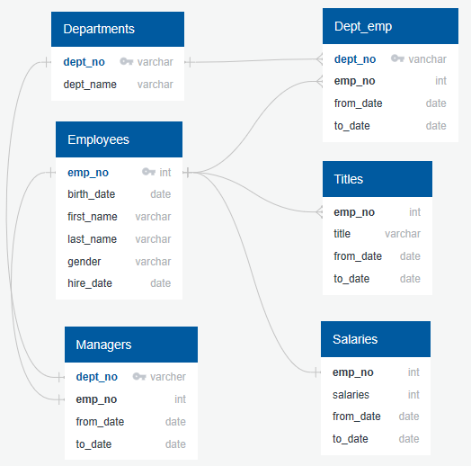

# Pewlett-Hackard-Analysis
•	Design an ERD that will apply to the data.  
•	Create and use a SQL database.  
•	Import and export large CSV datasets into pgAdmin.  
•	Practice using different joins to create new tables in pgAdmin.  
•	Write basic- to intermediate-level SQL statements. 

## Challenge Overview
To create the new list of potential mentors, who are eligible for retirement. The final query should return the potential mentor’s employee number, first and last name, their title, birth date and employment dates.

The goals are to:
•	Use an ERD to understand relationships between SQL tables.

•	Create new tables in pgAdmin by using different joins.
  1. Number of titles Retiring
  2. Only the Most Recent Titles
  3. Who’s Ready for a Mentor?
•	Write basic- to intermediate-level SQL statements.
  1. INNER JOIN
  2. PARTITION BY
  3. WHERE
•	Export new tables to a CSV file.
  1. titles_retiring.csv
  2. recent_title_count.csv
  3. ready_mentors.csv
